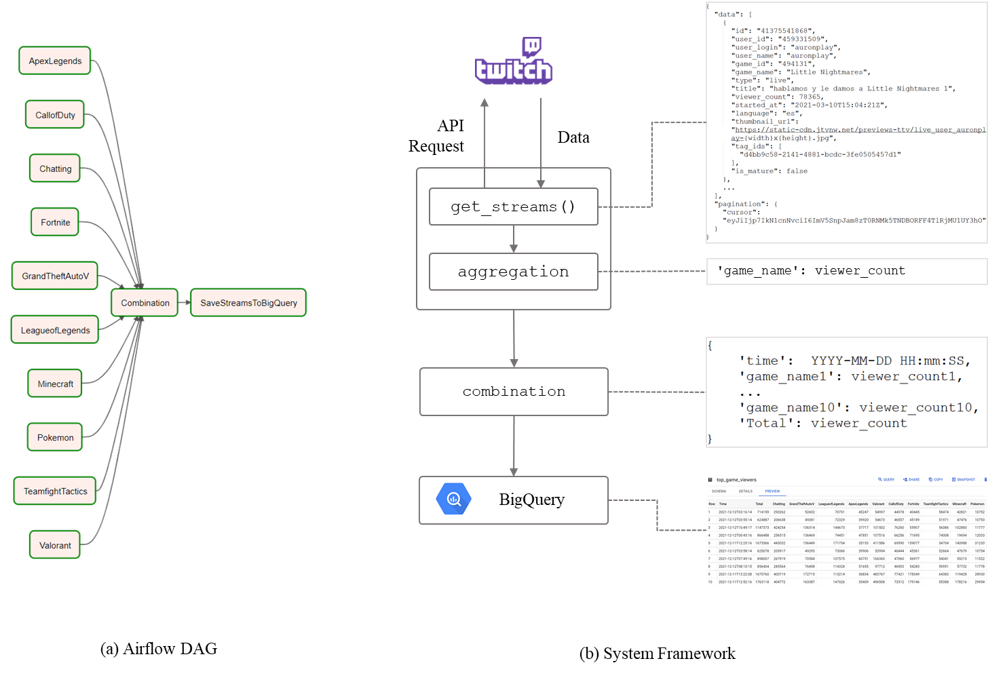
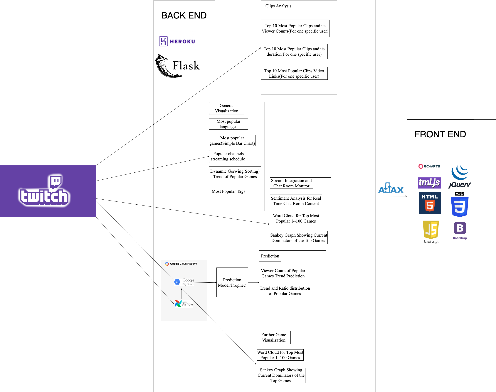

# TwitchStreamAnalysis
The project conducts visualization and prediction of Twitch data. The motivation of this project is to help start-up streamers to 
get familiar with the streaming industry through visualizations. New streamers can easily
see the what's going on, what kinds of games are the most popular, or what are the dominating
channels for a specific game. 

In addition, we also help start-up streamers to make decision. Similar to weather forecast, we 
provide prediction of further viewer count data for ten popular games. New streamers can easily see
 how many people will be watching a specific game, thus they can make decision of stream scheduling 
based on this result.

# Features
- Analyze and visualize data collected from Twitch API. 
- Predict the viewer counts for ten popular games.

# Data Collection
- Use Airflow to automate the data collection process. Each task get triggered 
evey five minutes.
- After aggregating and preprocessing, load data into Google Big Query for
Further analysis.

# Training Model
- Compared the result of several models(e.g. Random Forest, ARIMA, Prophet), and finally decided to use Prophet
as the prediction model.

# Architecture

[//]: # (# Earlier Demo)

[//]: # (![]&#40;StuffForREADME/Demo.gif&#41;)

# Final Demo
See YouTube Link.

https://www.youtube.com/watch?v=Zmr3t9IqcMI

# Instructions of running our project
Since there are API tokens contained in our code, thus for security reason, we have commented
those areas. However, we have deployed our project on the Heroku Platform. 

To run our project, please
1. Open every html file, and switch the domain variable to be local host.
2. Fill in api tokens using you own ones.
3. use pycharm to run flask framework, and then visit 127.0.0.1:5000 in chrome. 

Note that Stream Integration is only available when we delpoy them on cloud platform(Due to browser domain policy). We have shown this part in our youtube link.

Please use your own API and GCP credentials. Or please contact us. Note that key.json stores parts of the GCP service account credentials.
Same, for security reasons, we have commented all contents in those files.

Please note that based on our experience of developing with Twitch API, Twitch has web bot focusing on detecting if 
there are leaked tokens on Github. If it finds one, it deactivate it. We have met this several times. 
Even if I removed my keys in the repo, however, sometimes the keys still expire.
So if you find out that our web app does not work, it is really possible to be this reason. Please contact us if you 
have problem testing the web page. We will provide new credentials for your testing.

[//]: # (![img.png]&#40;StuffForREADME/pieChart1.png&#41;)

[//]: # ()
[//]: # (![img.png]&#40;StuffForREADME/barChart.png&#41;)

[//]: # ()
[//]: # (![img_1.png]&#40;StuffForREADME/waterfall.png&#41;)
